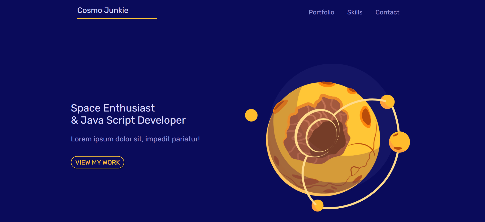

# Mobile-First Responsive Web Design

## Project Overview
This project is a **mobile-first responsive website** designed with modern web development techniques. It adapts seamlessly across devices, prioritizing the mobile user experience while providing enhanced layouts for larger screens.

### Key Features
- **Mobile-First Design**: Designed with small screens as the starting point, progressively enhanced for larger devices.
- **Custom Variables**: Uses CSS variables for consistent theming (e.g., `--primary` and `--secondary` colors).
- **Typography**: Includes custom font integration for a sleek and modern look.
- **Reusable Components**: Styled reusable elements such as buttons and inputs.
- **Grid Layout**: Utilizes CSS Grid for flexible and clean layout management.
- **Media Queries**: Handles screen size breakpoints for tablets and desktops, ensuring optimal layouts at all resolutions.

## Technologies Used
- **HTML**
- **CSS**
- **Responsive Design**
- **Mobile-First Approach**

## Design Philosophy
1. Start with the basics for small screens.
2. Enhance functionality and layout for larger screens using media queries.
3. Prioritize user experience across all device types.

### Screenshot

### Links

- Solution URL: [https://riquelme3m.github.io/iJunior-Mobile-First-Project/](https://riquelme3m.github.io/iJunior-Mobile-First-Project/)